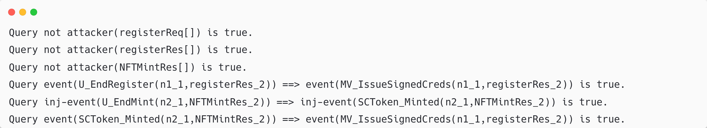
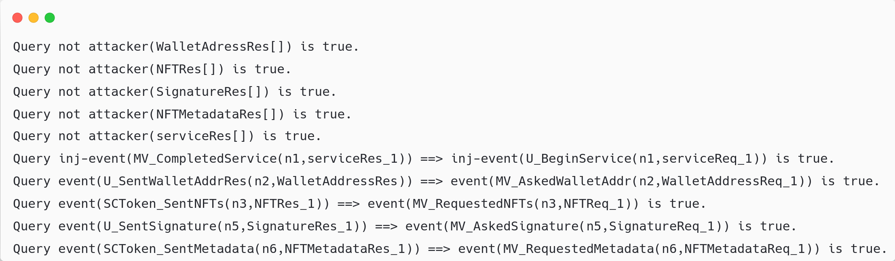

# Protocol Formal Verification (ProVerif)

[](https://creativecommons.org/licenses/by/4.0/)
[](https://bblanche.gitlabpages.inria.fr/proverif/)

ProVerif scripts and verification results for the registration and authentication protocols described in:

**A Secure Authentication Mechanism for Federated Metaverses Using Non-Fungible Tokens (NFTs)**
Mohammed Shakib Hossain, Khawaja Ehsun Ul Hawak, Mutasin Jawad, Md Yeasin Ali, Sagar Karmoker, Masum Alam Nahid, Hossain Shahriar, Md Sadek Ferdous
*IEEE Blockchain 2026 (IEEE Cybermatics Congress 2026)*

---

## Overview

This repository contains the ProVerif models used to formally verify the secrecy and authenticity properties of the NFT-based identity registration and authentication protocols proposed in the paper. The analysis uses correspondence and injective correspondence assertions to confirm correct event sequencing and one-to-one relationships for critical protocol actions. Full methodology and results are reported in Section VI of the paper.

## Contents

```
.
├── registration.pv                     # ProVerif model: Identity Registration protocol
├── authentication.pv                   # ProVerif model: Identity Authentication protocol
├── results/
│   ├── registration_result.png         # Verification output: registration protocol
│   └── authentication_result.png       # Verification output: authentication protocol
├── LICENSE
└── README.md
```

| File | Description |
|---|---|
| `registration.pv` | ProVerif model for the NFT-Metaverse Identity Registration protocol (Table III, Steps M1–M4). |
| `authentication.pv` | ProVerif model for the NFT-Metaverse Identity Authentication protocol (Table III, Steps M1–M10). |
| `results/registration_result.png` | ProVerif output confirming all secrecy and authenticity queries for the registration protocol. |
| `results/authentication_result.png` | ProVerif output confirming all secrecy and authenticity queries for the authentication protocol. |

## Verification Goals

**Secrecy.** The following protocol variables were modeled as private, to confirm they remain inaccessible to an adversary:
`registerReq`, `registerRes`, `NFTMintRes`, `WalletAddressRes`, `NFTRes`, `SignatureRes`, `serviceRes`, `NFTMetadataRes`.

**Authenticity.** Correspondence assertions verify correct event ordering for both protocol flows.

*Registration (Steps M1–M4):*
- `U_BeginRegister`, `MV_IssueSignedCreds`, `U_EndRegister` — Steps M1–M2
- `U_BeginMint`, `SCToken_Minted`, `U_EndMint` — Steps M3–M4

*Authentication (Steps M1–M10):*
- `U_BeginService` — Step M1
- `MV_AskedWalletAddr`, `U_SentWalletAddrRes` — Steps M2–M3
- `MV_RequestedNFTs`, `SCToken_SentNFTs` — Steps M4–M5
- `MV_AskedSignature`, `U_SentSignature` — Steps M6–M7
- `MV_RequestedMetadata`, `SCToken_SentMetadata` — Steps M8–M9
- `MV_CompletedService` — Step M10

## Results

ProVerif returns `true`, `false`, or `cannot be proven` for each query. All secrecy and authenticity queries returned `true` for both protocols, confirming that sensitive data remains confidential and that protocol events maintain the expected ordering and integrity.

### Registration Protocol

<p align="center">
  
</p>
<p align="center"><i>All secrecy and authenticity queries for the identity registration protocol (Steps M1–M4) returned <code>true</code>.</i></p>

### Authentication Protocol

<p align="center">
  
</p>
<p align="center"><i>All secrecy and authenticity queries for the identity authentication protocol (Steps M1–M10) returned <code>true</code>.</i></p>

## Running the Verification

1. Install [ProVerif](https://bblanche.gitlabpages.inria.fr/proverif/) (tested with version 2.0x).
2. From the repository root, run:
   ```bash
   proverif registration.pv
   proverif authentication.pv
   ```
3. Output should match the results shown above and the validation reported in Section VI of the paper.

## Related Repositories

- [User study questionnaires](#) — SUS and custom UX survey instruments used for the usability evaluation.

## Citation

If you use these materials, please cite the paper:

```bibtex
@inproceedings{hossain2026federated,
  title     = {A Secure Authentication Mechanism for Federated Metaverses Using Non-Fungible Tokens (NFTs)},
  author    = {Hossain, Mohammed Shakib and Hawak, Khawaja Ehsun Ul and Jawad, Mutasin and Ali, Md Yeasin and Karmoker, Sagar and Nahid, Masum Alam and Shahriar, Hossain and Ferdous, Md Sadek},
  booktitle = {Proceedings of the IEEE Blockchain Conference 2026 (IEEE Cybermatics Congress)},
  year      = {2026},
  publisher = {IEEE}
}
```

## References

[1] B. Blanchet, B. Smyth, V. Cheval, and M. Sylvestre, "ProVerif 2.00: Automatic Cryptographic Protocol Verifier, User Manual and Tutorial," 2018.

## License

This work is licensed under a [Creative Commons Attribution 4.0 International License (CC BY 4.0)](https://creativecommons.org/licenses/by/4.0/). You are free to share and adapt these materials for any purpose, provided appropriate credit is given to the original authors and this repository.

## Contact

**Mohammed Shakib Hossain**
Department of Computer Science and Engineering, BRAC University, Dhaka, Bangladesh
mohammed.shakib.hossain@g.bracu.ac.bd
